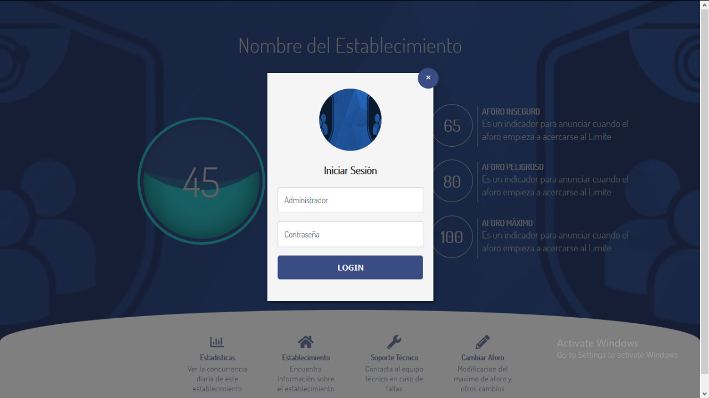
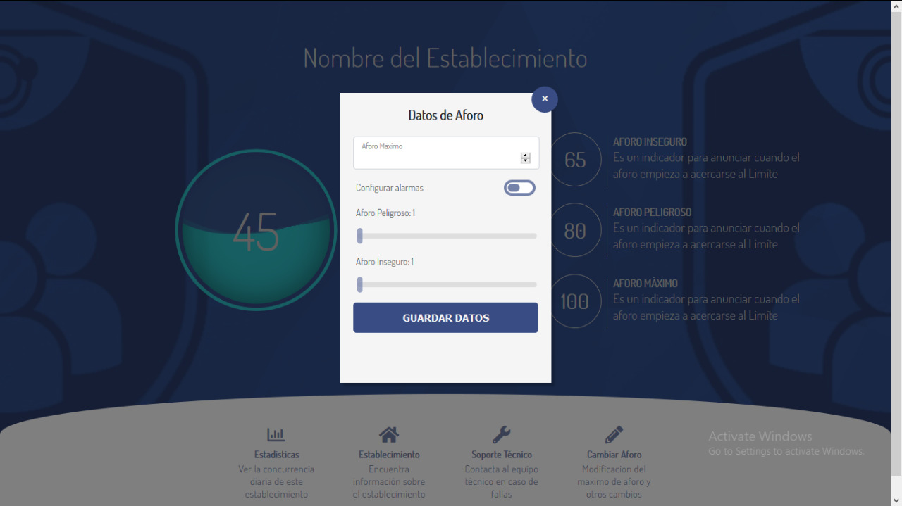
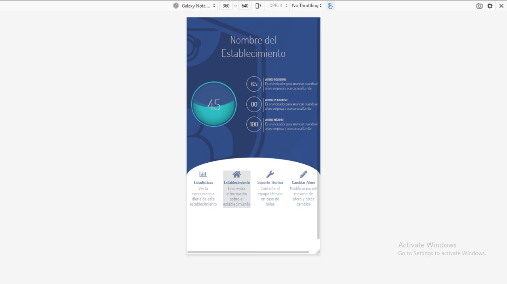

Iteración N°1

# BackEnd-Detection (Deteccion BackEnd)

# BackEnd-Detection-Background-Subtraction (BackEnd-Detection-Sustraccion de Fondo)

# FrontEnd (Vista administrador Login)

# FrontEnd (Vista administrador Update Aforo)

# FrontEnd (FrontEnd View Responsive)
