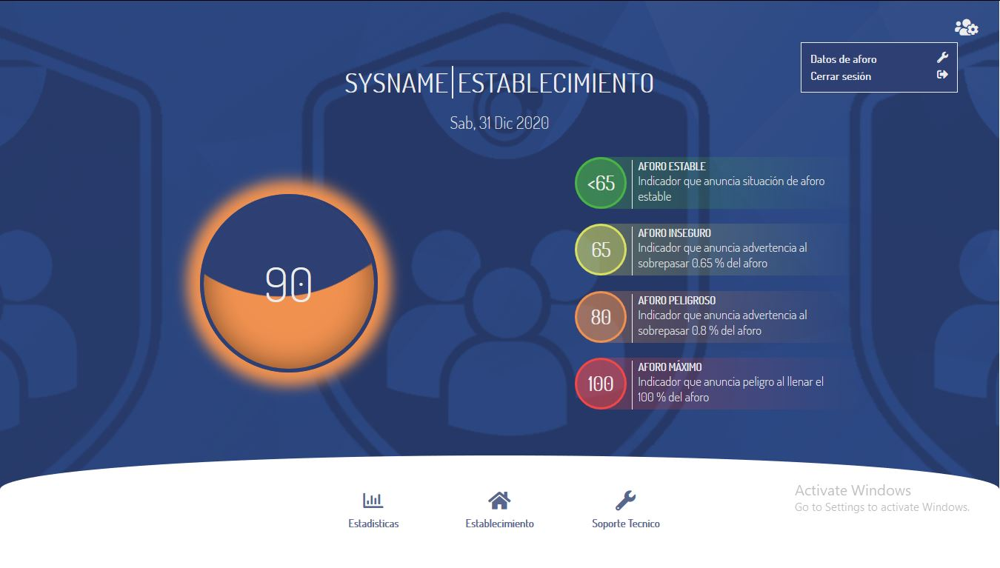
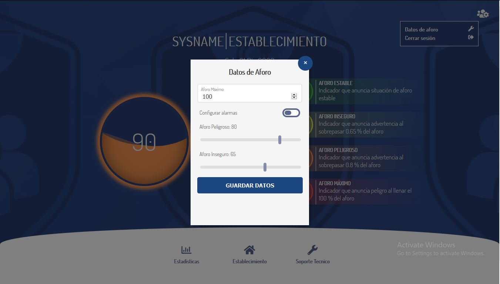
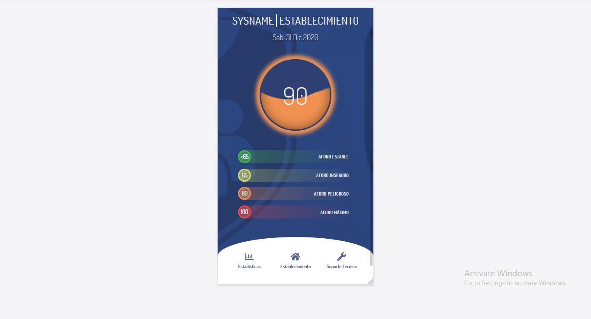
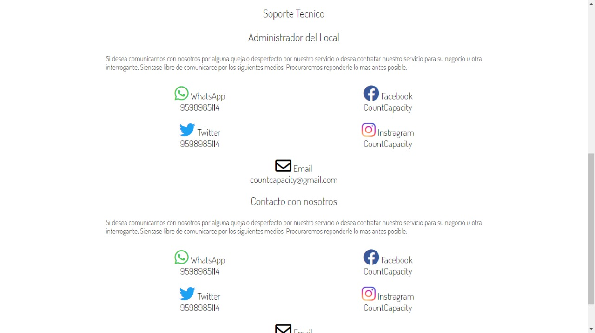
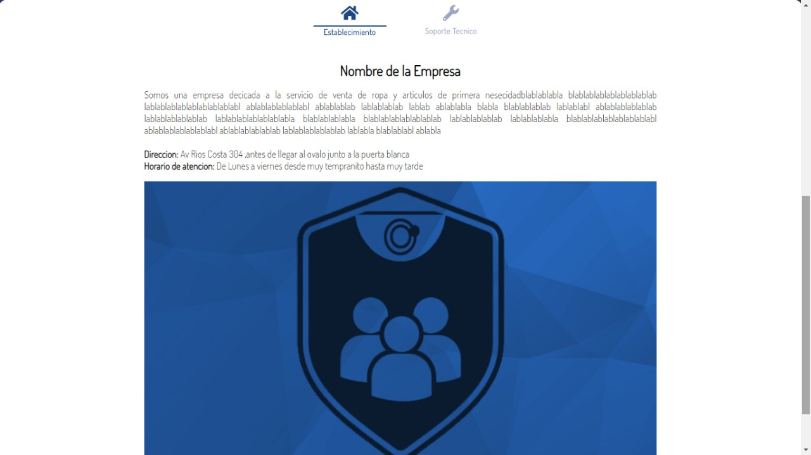
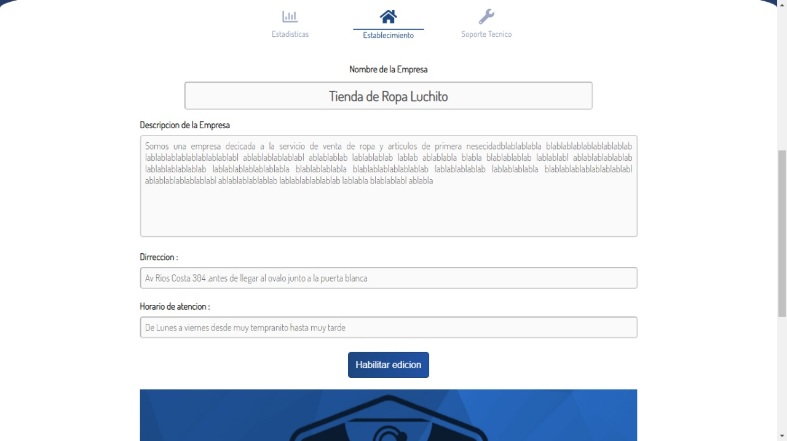
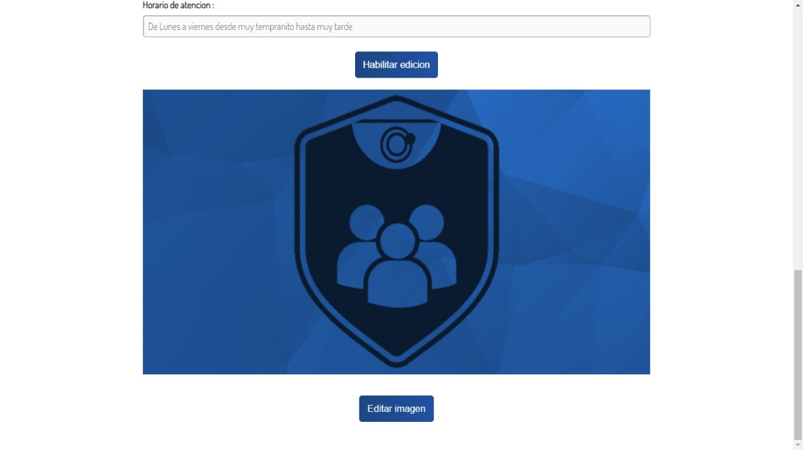
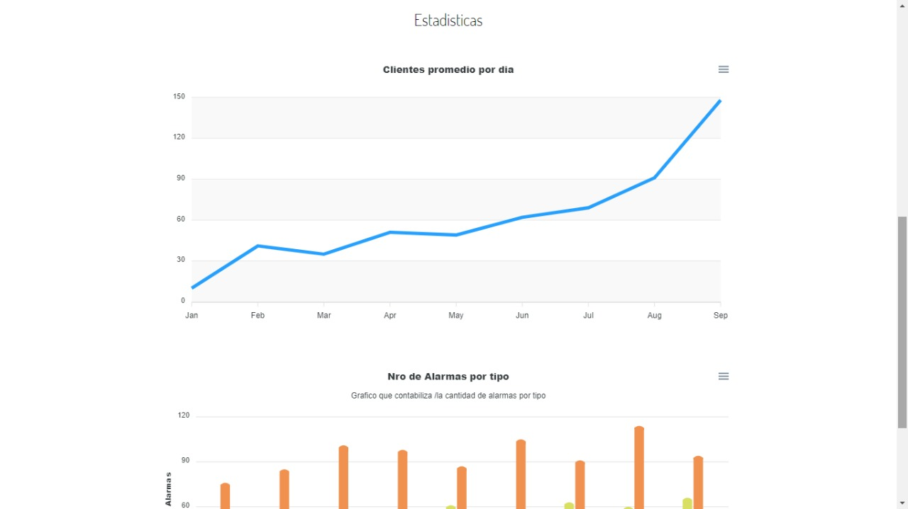
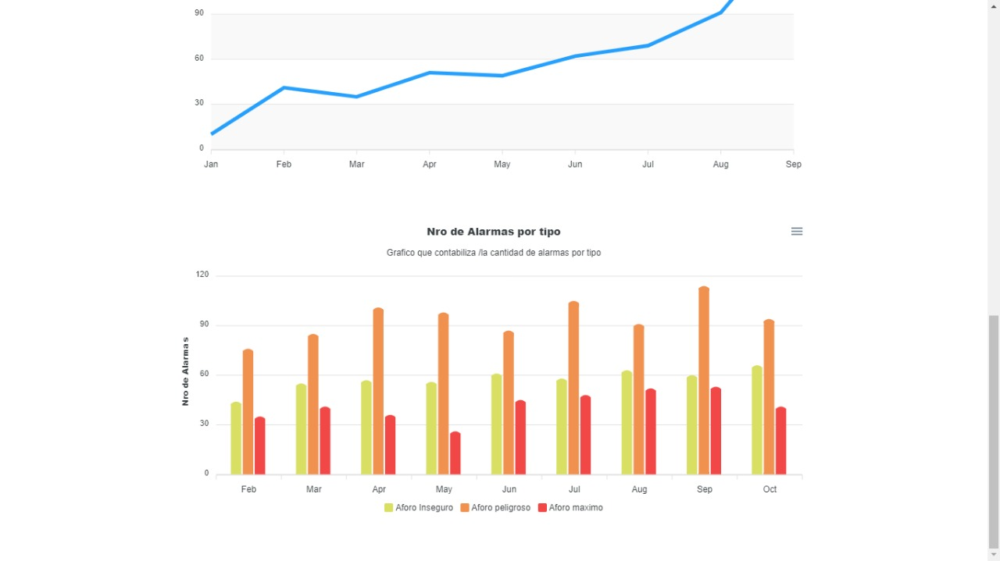

Iteración N°1

# BackEnd-Detection (Deteccion BackEnd + Mostrar Camaras + Actualizacion de base de datos en tiempo real)

### BackEnd-Detection 

### Con elementos visuales

### Sin elementos visuales

# Frontend-State Aforo Data View (Frontend + Mostrar Datos en tiempo real + vista de usuario+ vista de administrador)

### Vista principal de aforo 

### Vista de modificar aforo

### Vista Responsive

### soporte tecnico cliente

### establecimiento cliente

### establecimieto admin p1

### estableciemiento admin p2

### Estadisticas admin p1

### estadisticas admin p2

