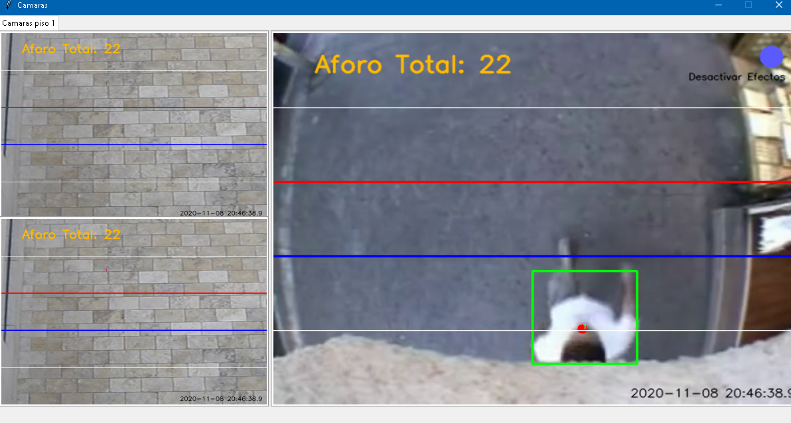
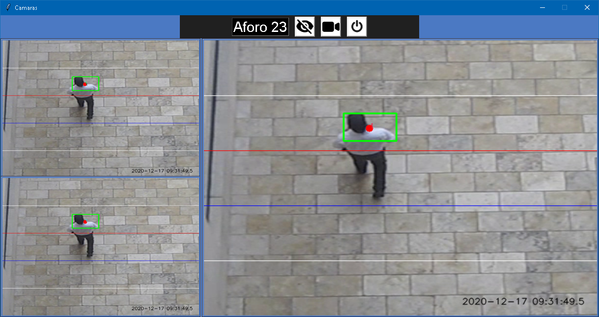
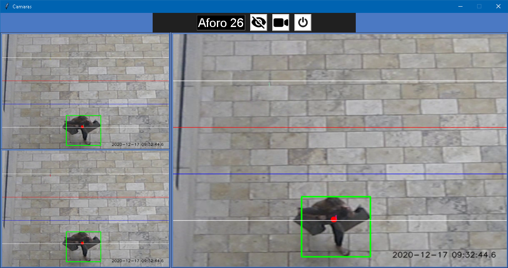
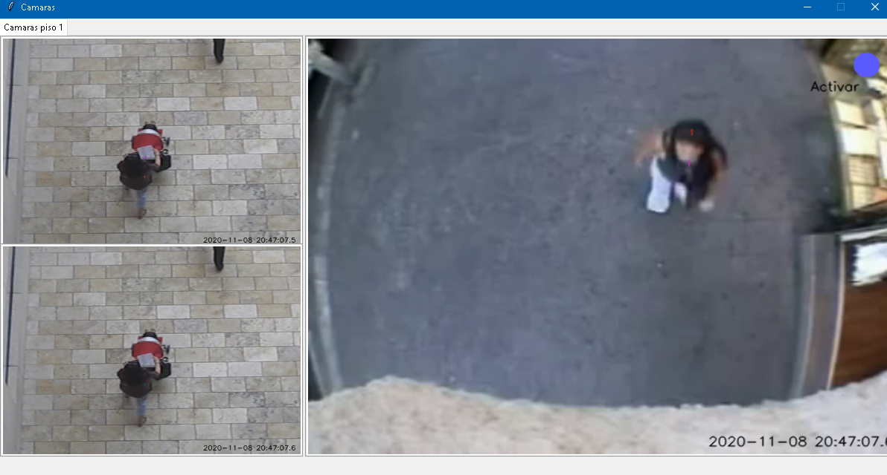
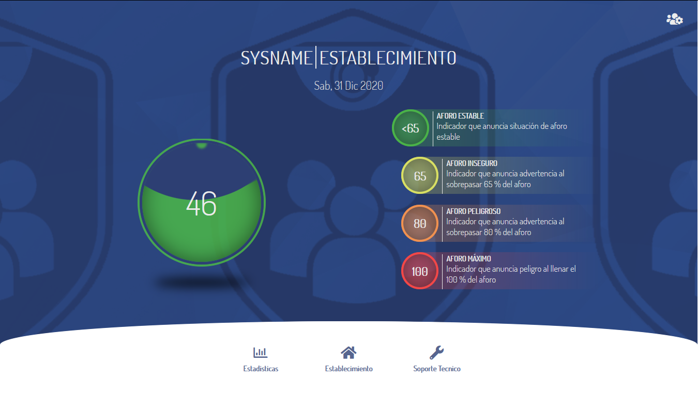
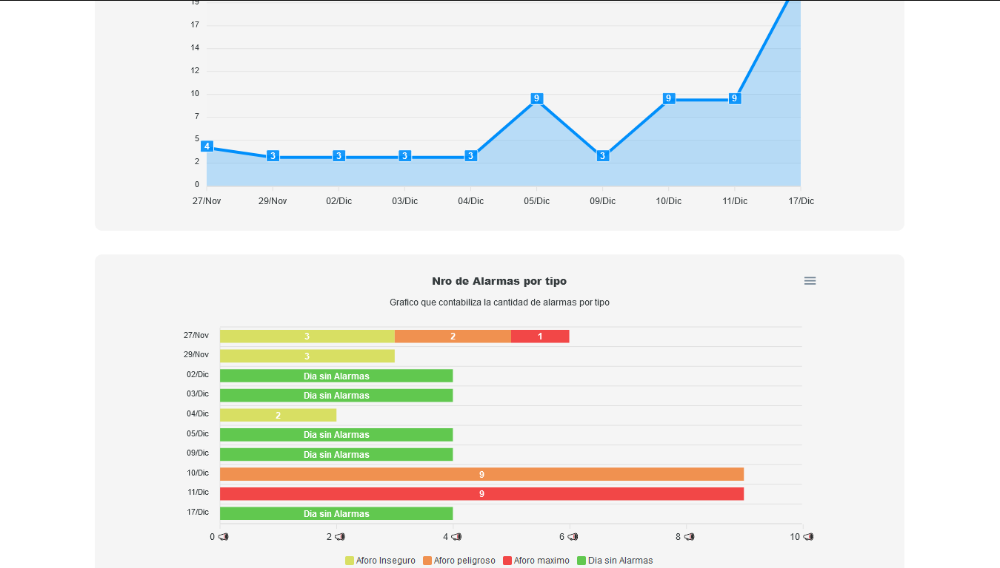
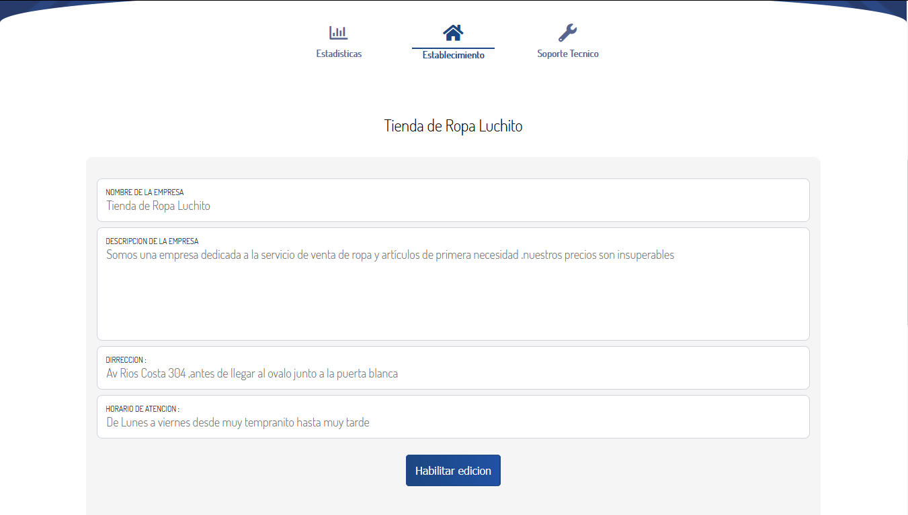
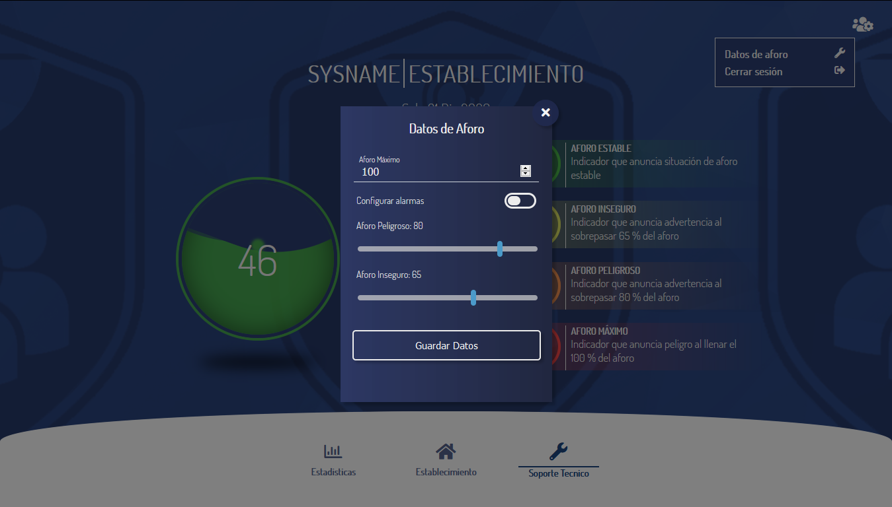
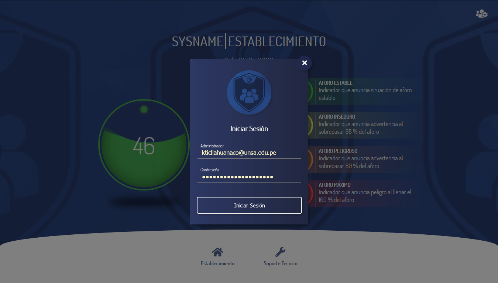
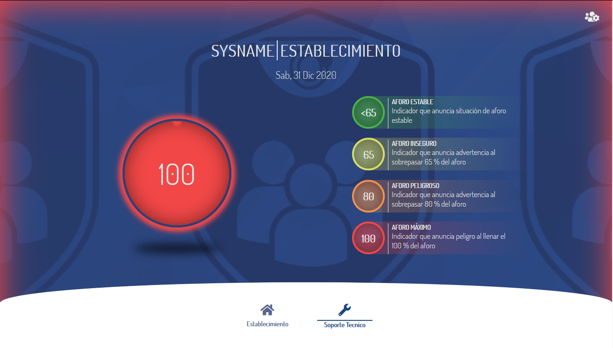

Iteración N°4

# BackEnd-Detection 

### BackEnd-Detection Interfaz Inicial

### BackEnd-Detection Interfaz Activando Sistema

### BackEnd-Detection Interfaz Con Efectos Visuales

### BackEnd-Detection Interfaz Sin Efectos Visuales

### FrontEnd Admin - Usuario Normal: Inicial( es similar a la interfaz de usuario normal, pero incluye privilegios)

### FrontEnd Admin Interfaz: de administrador Estadísticas

### FrontEnd Admin - Usuario Normal: Datos del establecimiento 

### FrontEnd Aforo Form: Aforo Máximo y límites para las alarmas   

### FrontEnd Login: Solo para cuentas de administrador

### FrontEnd Interfaz estado Saturado

