Iteración N°1

# BackEnd-Detection 

### BackEnd-Detection 

### Web System

#### Vista Principal en los diferentes estados
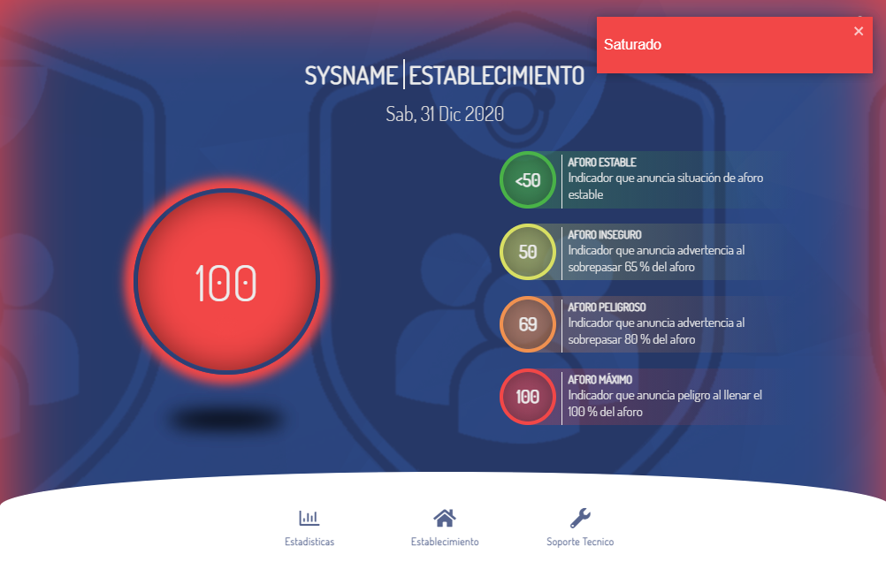
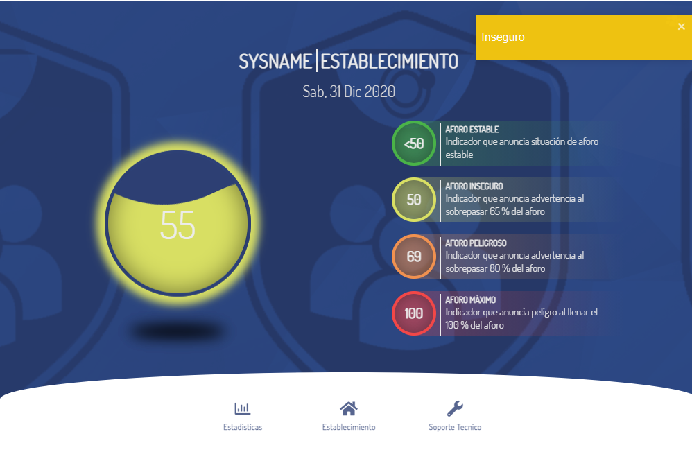
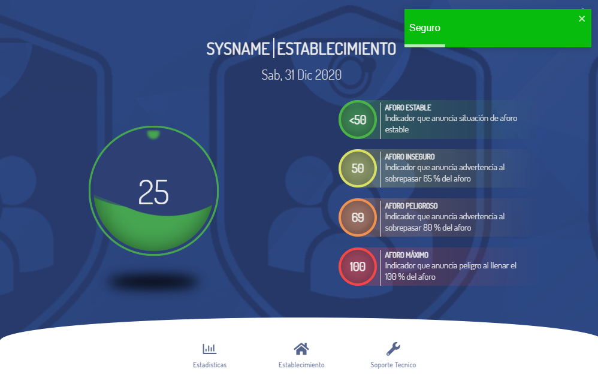
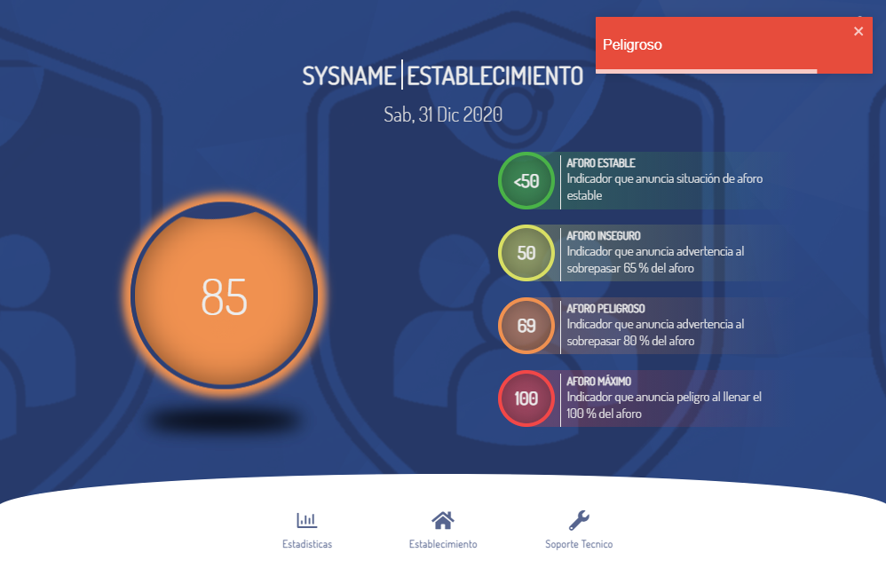

#### Vista Principal con login abierto
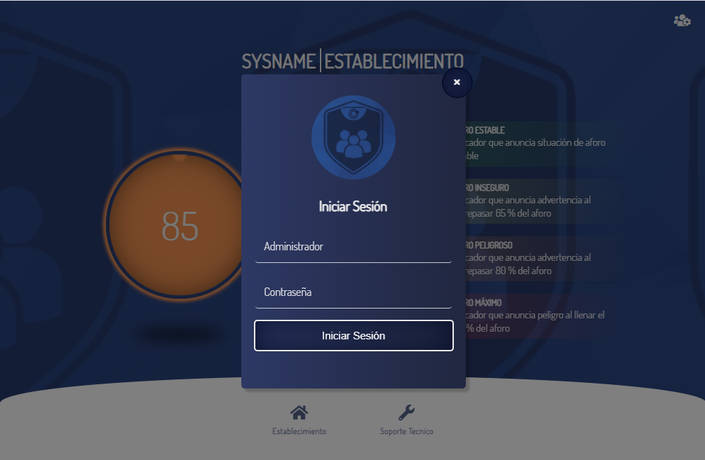

####  Vistas del Administrador

####  Opcion Soporte Técnino
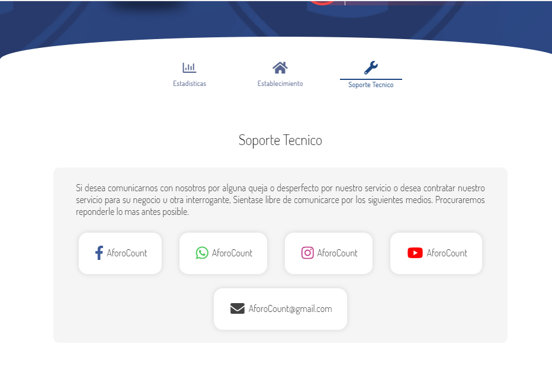

####  Opcion Establecimiento
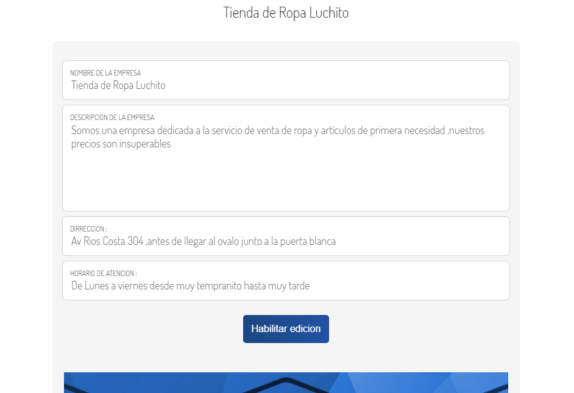
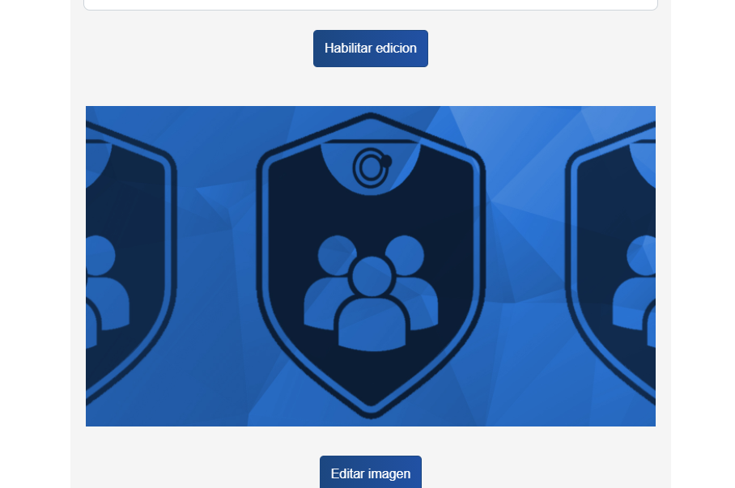

#### Opcion Estadisticas
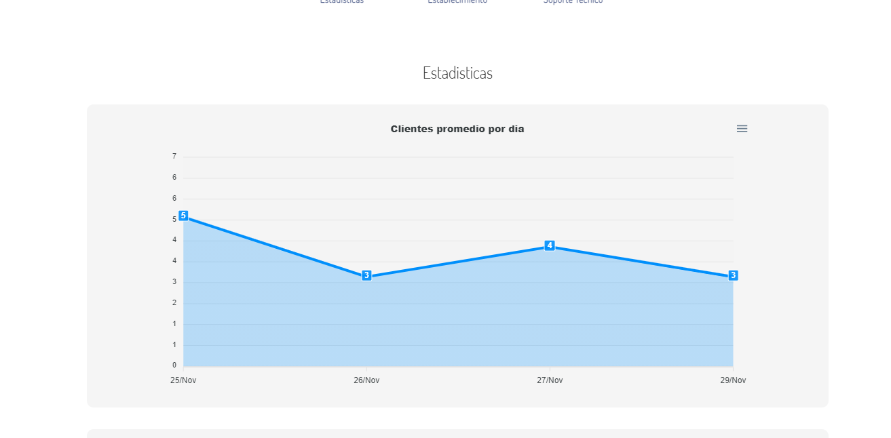
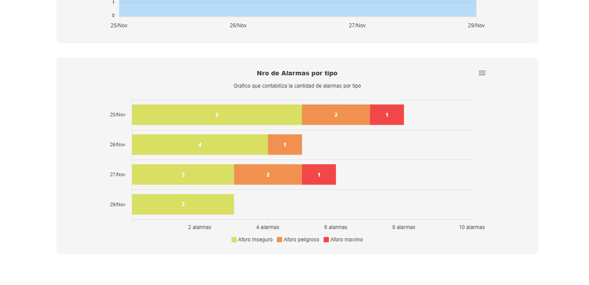

#### Vistas del Usuario

#### Opcion Soporte Técnico
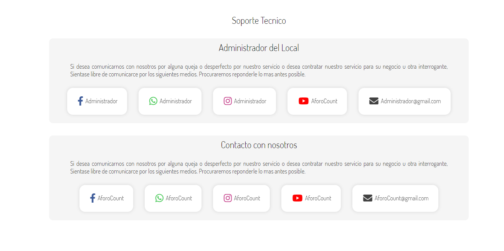

#### Opcion Establecimiento
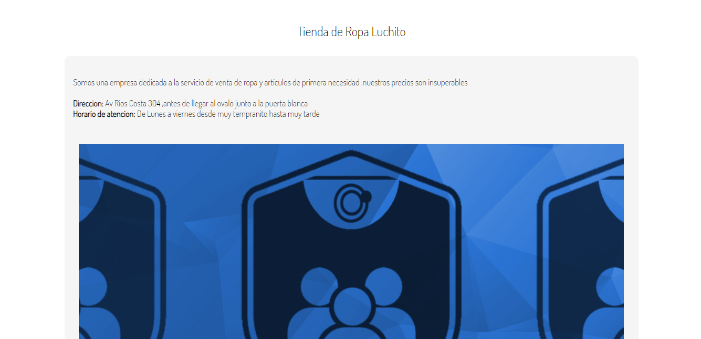

